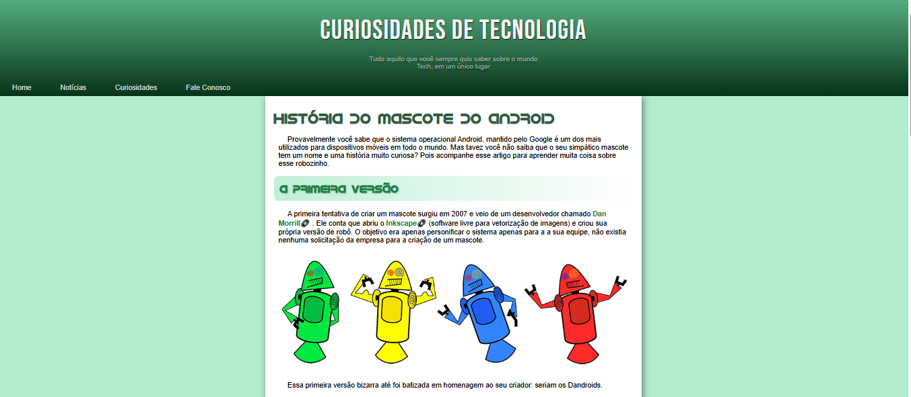
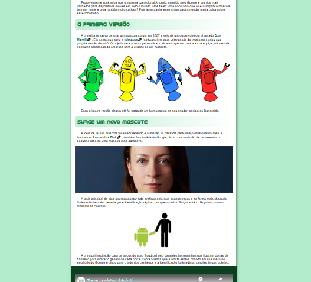
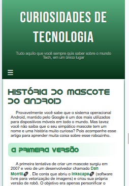
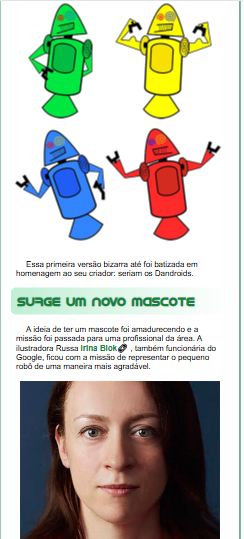
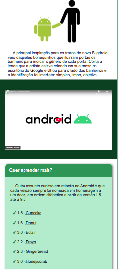

# 🧠 Curiosidades de Tecnologia - História do Mascote do Android

Este é um projeto desenvolvido como exercício de HTML5 e CSS3. A proposta é criar uma página responsiva que apresenta a **história do mascote do Android**, também conhecido como **Bugdroid**, de forma clara, visual e educativa.

A página utiliza fontes personalizadas, imagens ilustrativas, vídeo incorporado e técnicas de responsividade para se adaptar a diferentes tamanhos de tela (desktop e mobile).

---

## 🌐 Acesse o site aqui:
🔗 https://minfermis.github.io/android-history-site/

---

## 📸 Prévia do Projeto

### 🖥️ Versão Desktop

  

  

---

### 📱 Versão Mobile

---

## 🛠️ Tecnologias utilizadas

- HTML5
- CSS3
- Google Fonts
- Font personalizada (iDroid)
- Design responsivo com media queries

---

## 📄 Licença

Este projeto está licenciado sob a Licença MIT.  
Sinta-se livre para estudar, modificar e utilizar!

